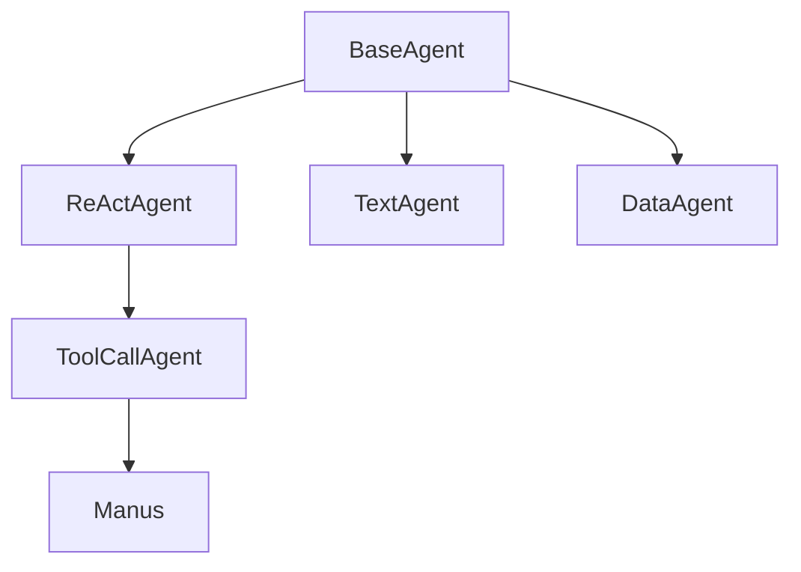
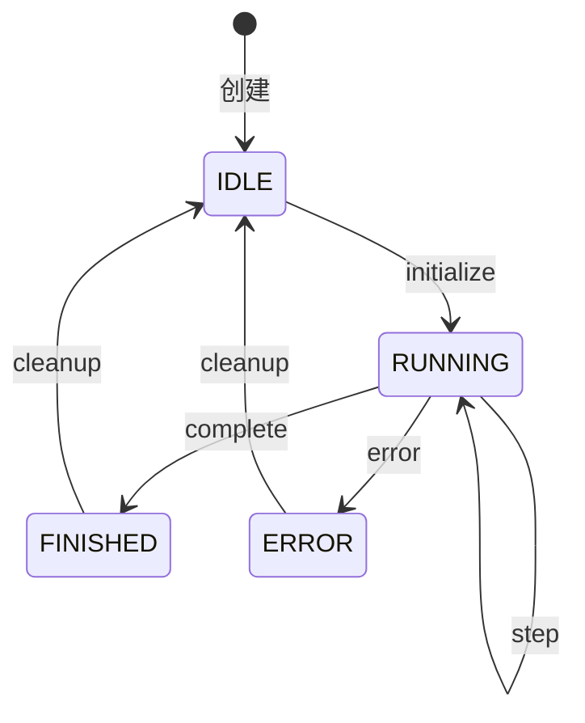

# Agent 系统设计与实现

## 概述

Agent 系统采用分层设计，通过继承和组合实现不同类型代理的功能扩展。系统的核心是基于 ReAct（Reasoning and Acting）模式，让代理能够思考和行动。

## 代理层次结构

### 层次说明

1. **BaseAgent**: 基础抽象层
2. **ReActAgent**: 思考-行动模式层
3. **ToolCallAgent**: 工具调用层
4. **具体代理**: 特定功能实现层

## 代理生命周期

## 核心组件

1. **状态管理**
2. **消息处理**
3. **工具调用**
4. **错误处理** 