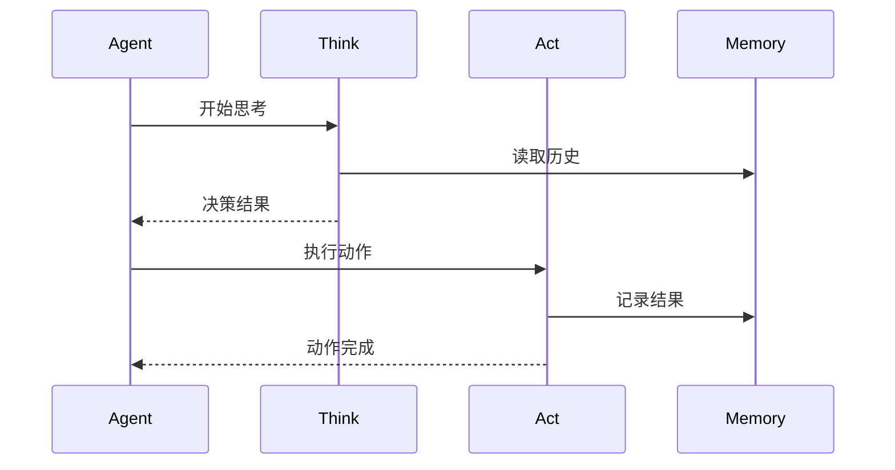

# ReActAgent - 思考行动代理

## 设计理念

ReActAgent 实现了 ReAct（Reasoning and Acting）模式，将代理的行为分为思考和行动两个阶段。

## 工作流程



## 核心接口

```typescript
export abstract class ReActAgent extends BaseAgent {
  protected abstract think(): Promise<boolean>;
  protected abstract act(): Promise<string>;
  
  protected async step(): Promise<string> {
    const shouldAct = await this.think();
    if (!shouldAct) {
      return 'Thinking complete';
    }
    return await this.act();
  }
}
```

## 实现细节

### 1. 思考阶段

```typescript
protected abstract async think(): Promise<boolean> {
  // 分析当前状态
  // 决定下一步行动
  // 返回是否需要执行动作
}
```

### 2. 行动阶段

```typescript
protected abstract async act(): Promise<string> {
  // 执行决定的动作
  // 返回执行结果
}
```

## 使用示例

```typescript
class SimpleReActAgent extends ReActAgent {
  protected async think(): Promise<boolean> {
    const lastMessage = this.memory.getLastMessage();
    return !!lastMessage && needsResponse(lastMessage);
  }

  protected async act(): Promise<string> {
    // 执行响应动作
    return 'Action result';
  }
}
``` 