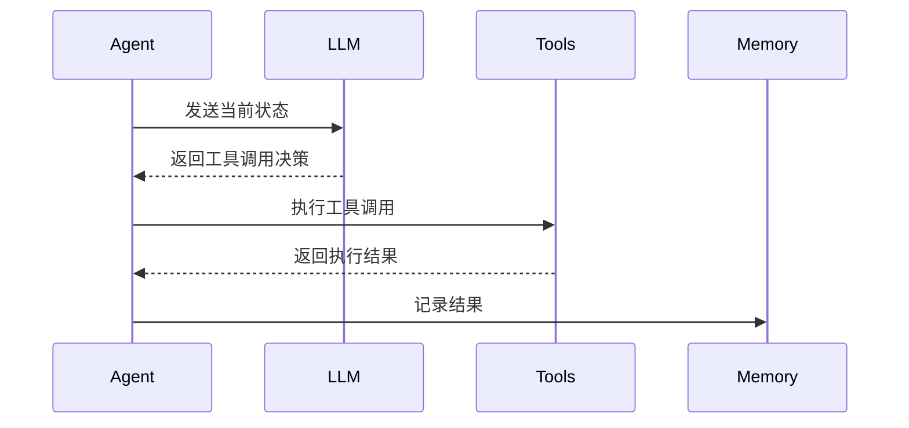

# ToolCallAgent - 工具调用代理

## 设计理念

ToolCallAgent 扩展了 ReAct 模式，增加了工具调用能力。它能够：

1. 管理工具集合
2. 解析工具调用
3. 执行工具操作
4. 处理工具结果

## 工作流程



## 核心功能

### 1. 工具管理

```typescript
export class ToolCallAgent extends ReActAgent {
  protected availableTools: ToolCollection;
  protected toolCalls: ToolCall[] = [];
  
  addTool(tool: BaseTool): void {
    this.availableTools.addTool(tool);
  }
}
```

### 2. 思考实现

```typescript
protected async think(): Promise<boolean> {
  // 获取 LLM 响应
  const response = await this.llm.askTool(
    this.memory.messages,
    this.systemPrompt ? [Message.systemMessage(this.systemPrompt)] : undefined,
    this.availableTools.toParams(),
    this.toolChoices
  );
  
  // 处理工具调用
  this.toolCalls = response.tool_calls || [];
  return this.toolCalls.length > 0;
}
```

### 3. 行动实现

```typescript
protected async act(): Promise<string> {
  const results: string[] = [];
  
  for (const call of this.toolCalls) {
    const result = await this.executeTool(call);
    results.push(result);
  }
  
  return results.join('\n\n');
}
```

## 工具调用处理

### 1. 执行工具

```typescript
private async executeTool(command: ToolCall): Promise<string> {
  const name = command.function.name;
  const args = JSON.parse(command.function.arguments || '{}');
  
  const result = await this.availableTools.execute(name, args);
  return this.formatToolResult(name, result);
}
```

### 2. 特殊工具处理

```typescript
private async handleSpecialTool(name: string, result: any): Promise<void> {
  if (this.isSpecialTool(name) && this.shouldFinishExecution(name, result)) {
    this.state = AgentState.FINISHED;
  }
}
```

## 使用示例

```typescript
// 创建工具调用代理
const agent = new ToolCallAgent({
  name: 'tool-agent',
  systemPrompt: 'You are a helpful assistant that can use tools.'
});

// 添加自定义工具
agent.addTool(new CustomTool());

// 运行代理
const result = await agent.run('Help me with this task');
```

## 扩展指南

### 1. 添加新工具

```typescript
class NewTool extends BaseTool {
  constructor() {
    super('new_tool', 'Description', {
      type: 'object',
      properties: {
        // 工具参数定义
      }
    });
  }

  async execute(args: any): Promise<any> {
    // 工具实现
  }
}
```

### 2. 自定义工具处理

```typescript
class CustomToolCallAgent extends ToolCallAgent {
  protected async handleToolResult(result: any, tool: BaseTool): Promise<void> {
    // 自定义结果处理逻辑
  }
}
``` 