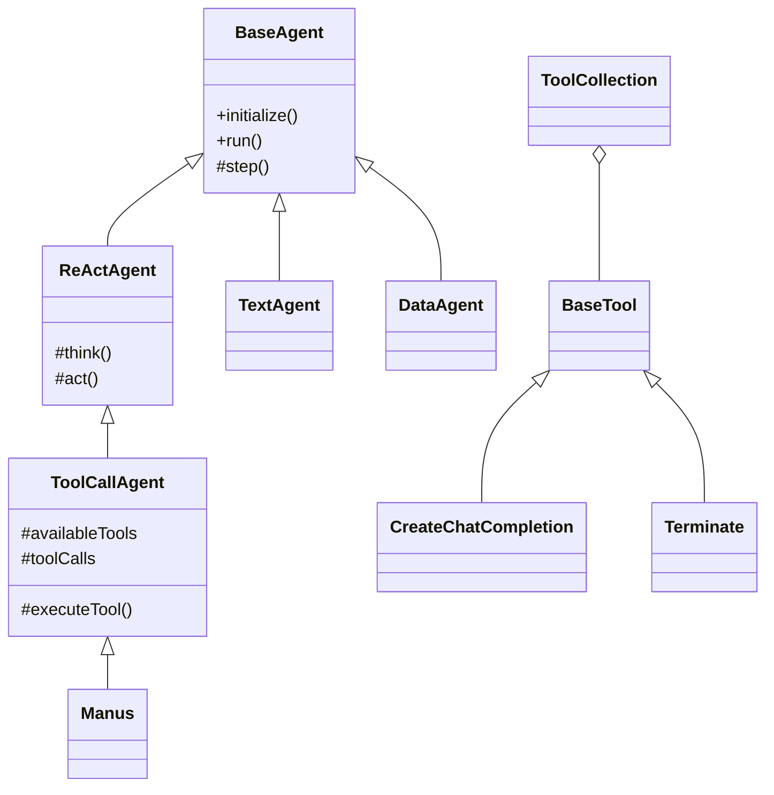

# Agent System 技术设计文档

## 1. 系统概述

Agent System 是一个基于 TypeScript 实现的智能代理系统，支持多种代理类型和工具调用。系统从 Python 版本迁移而来，保持了原有的功能特性，同时利用 TypeScript 的类型系统提供了更好的开发体验。

### 1.1 核心特性

- 模块化的代理系统
- 可扩展的工具集成
- 类型安全的 API
- 灵活的消息处理
- 完整的错误处理
- 详细的日志记录

## 2. 系统架构

### 2.1 核心模块

```
src/
├── agent/              # 代理模块
│   ├── base.ts        # 基础代理类
│   ├── reactAgent.ts  # ReAct 模式代理
│   ├── toolCallAgent.ts # 工具调用代理
│   ├── manus.ts       # Manus 通用代理
│   ├── textAgent.ts   # 文本处理代理
│   ├── dataAgent.ts   # 数据处理代理
│   └── agentFactory.ts # 代理工厂
├── tool/               # 工具模块
│   ├── base.ts        # 工具基类
│   ├── terminate.ts   # 终止工具
│   ├── createChatCompletion.ts # 聊天完成工具
│   └── toolCollection.ts # 工具集合
├── schema.ts          # 数据模型
├── config.ts          # 配置管理
└── llm.ts            # LLM 接口
```

### 2.2 类图关系



## 3. 核心流程

### 3.1 代理执行流程

1. 初始化
   ```typescript
   const agent = new Manus();
   await agent.initialize();
   ```

2. 消息处理
   ```typescript
   const result = await agent.run('Tell me about the solar system');
   ```

3. 思考-行动循环
   ```mermaid
   sequenceDiagram
       participant Agent
       participant LLM
       participant Tool
       Agent->>LLM: 发送消息
       LLM-->>Agent: 返回思考结果
       Agent->>Tool: 执行工具
       Tool-->>Agent: 返回工具结果
   ```

### 3.2 工具调用流程

1. 工具选择
2. 参数准备
3. 执行调用
4. 结果处理

## 4. 关键实现

### 4.1 消息处理

```typescript
export class Message {
  role: MessageRole;
  content: string | null;
  toolCalls?: ToolCall[];
  name?: string;
  toolCallId?: string;

  static fromToolCalls(toolCalls: ToolCall[], content: string = ''): Message {
    return new Message('assistant', content, toolCalls);
  }
}
```

### 4.2 工具系统

```typescript
export abstract class BaseTool {
  name: string;
  description: string;
  parameters?: Record<string, any>;

  abstract execute(...args: any[]): Promise<any>;
}
```

### 4.3 LLM 接口

```typescript
export class LLM {
  async askTool(
    messages: Message[],
    systemMsgs?: Message[],
    tools?: Record<string, any>[],
    toolChoice?: 'none' | 'auto' | 'required'
  ): Promise<ChatCompletionMessage>;
}
```

## 5. 使用示例

### 5.1 基本使用

```typescript
import { Manus } from './agent/manus';
import logger from './utils/logger';

async function main() {
  // 创建代理实例
  const agent = new Manus();
  await agent.initialize();

  // 运行代理
  const result = await agent.run(
    'Tell me about the solar system and its planets. Keep the response concise.'
  );

  logger.info(`Result: ${result}`);
  await agent.cleanup();
}
```

### 5.2 自定义工具

```typescript
import { BaseTool } from './tool/base';

class CustomTool extends BaseTool {
  constructor() {
    super('custom_tool', 'A custom tool', {
      type: 'object',
      properties: {
        input: { type: 'string' }
      }
    });
  }

  async execute(args: { input: string }): Promise<string> {
    return `Processed: ${args.input}`;
  }
}

// 使用自定义工具
const agent = new Manus();
agent.addTool(new CustomTool());
```

### 5.3 配置示例

```json
{
  "llm": {
    "model": "gpt-4",
    "baseUrl": "https://api.openai.com/v1",
    "maxTokens": 4096,
    "temperature": 0.7
  },
  "agents": {
    "manus": {
      "maxSteps": 30,
      "duplicateThreshold": 2
    }
  }
}
```

## 6. 最佳实践

### 6.1 错误处理

- 使用 try-catch 包装异步操作
- 提供详细的错误信息
- 实现优雅的降级策略

### 6.2 性能优化

- 缓存 LLM 实例
- 合理设置超时时间
- 避免不必要的工具调用

### 6.3 扩展建议

- 实现新的代理类型时继承适当的基类
- 工具实现时遵循单一职责原则
- 保持配置的灵活性

## 7. 调试指南

### 7.1 日志级别

```typescript
logger.debug('Detailed information');
logger.info('General information');
logger.warning('Warning messages');
logger.error('Error messages');
```

### 7.2 常见问题

1. 工具调用失败
   - 检查工具参数格式
   - 验证工具注册状态
   - 查看详细错误日志

2. 消息循环
   - 检查重复消息检测
   - 调整最大步骤数
   - 优化提示词

## 8. 后续规划

1. 功能增强
   - 支持更多 LLM 模型
   - 添加并行工具执行
   - 实现工具结果缓存

2. 性能优化
   - 实现批量请求
   - 优化内存使用
   - 添加性能监控

3. 开发体验
   - 提供更多示例
   - 完善文档
   - 添加测试用例 